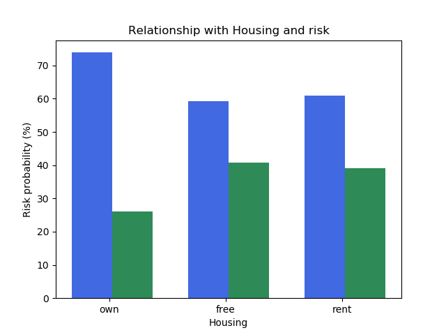

# Credit-Card-Customers
Data analysis on credit card details of customers.

The German Credit Risk is a publicly available dataset which can be used to analyze the financial behavior of various customers. The primary goal was to predict whether or not a customer will default on their loan or not. There are various other equally important (univariate and bivariate) analysis here, for example: gender vs jobs, housing vs risk etc.

