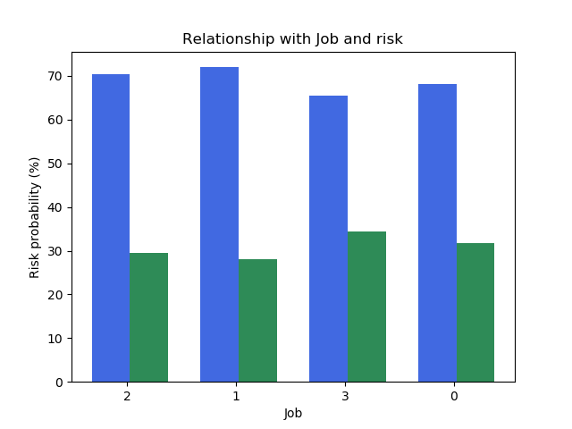
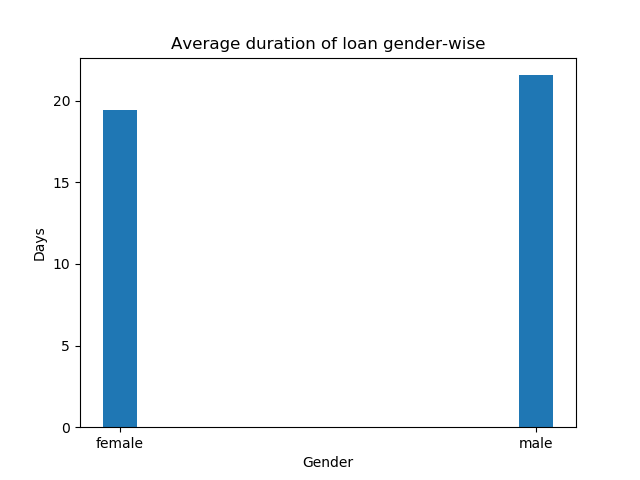

# Credit-Card-Customers
Data analysis on credit card details of customers.

The German Credit Risk is a publicly available dataset which can be used to analyze the financial behavior of various customers. The primary goal was to predict whether or not a customer will default on their loan or not. There are various other equally important (univariate and bivariate) analysis here, for example: gender vs jobs, housing vs risk etc.

Some observations based on the analysis:

People having own housing had highest percentage of safe loans, while people having free housing had lowest percentage of safe loans.

People using loan for radio/TV had highest percentage of safe loans, while people using the loan for vacation/others had lowest percentage for safe loans.

People having 1 job(s) had lowest percentage of defaults while people having 3 job(s) had the highest.

Applying Logistic Regression to data:
Accuracy score = 74.00%

